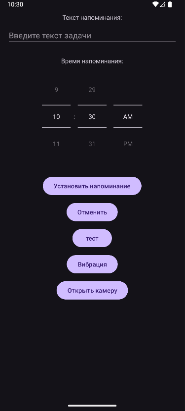
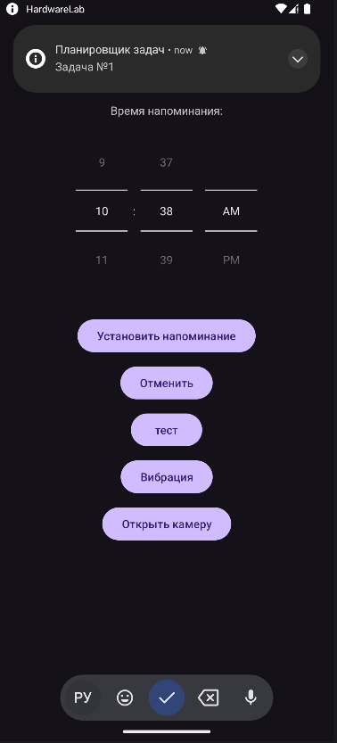
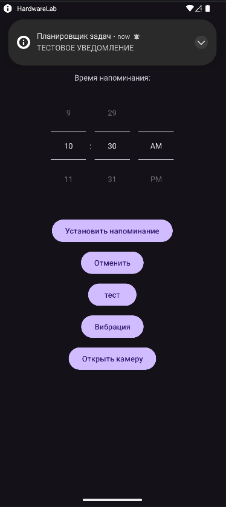
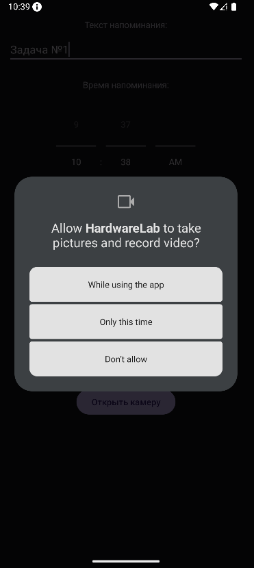

<div align="center">

# Отчёт

</div>

<div align="center">

## Практическая работа №10

</div>

<div align="center">

## Использование аппаратных возможностей устройства. Разрешения, уведомления, вибрация, камера

</div>

**Выполнил:** Деревянко Артём Владимирович<br>
**Курс:** 2<br>
**Группа:** ИНС-б-о-24-2<br>
**Направление:** 09.03.02 Информационные системы и технологии<br>
**Проверил:** Потапов Иван Романович

---

### Цель работы
Изучить механизм работы с разрешениями в Android, научиться создавать уведомления Notification), управлять вибрацией устройства, а также получать доступ к камере для предварительного просмотра изображения.

### Ход работы
#### Задание 1: Создание проекта и подготовка манифеста
1. Был открыт Android Studio и создан новый проект с шаблоном **Empty Views Activity**. Проекту дано имя `HardwareLab`.
2. В файл `AndroidManifest.xml` и добавлены разрешения, необходимые для варианта 1.
```xml
<?xml version="1.0" encoding="utf-8"?>
<manifest xmlns:android="http://schemas.android.com/apk/res/android"
    package="com.example.hardwarelab">

    <uses-permission android:name="android.permission.VIBRATE"/>
    <uses-permission android:name="android.permission.SCHEDULE_EXACT_ALARM"/>
    <uses-permission android:name="android.permission.POST_NOTIFICATIONS"/>
    <uses-permission android:name="android.permission.CAMERA"/>
    <uses-feature android:name="android.hardware.camera" android:required="false"/>

    <application
        android:allowBackup="true"
        android:icon="@mipmap/ic_launcher"
        android:label="@string/app_name"
        android:theme="@style/Theme.HardwareLab">

        <activity
            android:name=".MainActivity"
            android:exported="true">
            <intent-filter>
                <action android:name="android.intent.action.MAIN" />
                <category android:name="android.intent.category.LAUNCHER" />
            </intent-filter>
        </activity>

        <activity android:name=".CameraActivity" />
        <receiver android:name=".AlarmReceiver" android:exported="false"/>
    </application>
</manifest>
```

#### Задание 2: Запрос разрешений во время выполнения
Реализован метод для проверки и запроса опасных разрешений. Использован `ActivityResultContracts.RequestPermission()` для асинхронного запроса разрешений `POST_NOTIFICATIONS` (Android 13+) и `CAMERA` (Android 6+). При отказе выводится соответствующее уведомление через `Toast`.
##### Код запроса разрешений
```java
private final ActivityResultLauncher<String> requestPermissionLauncher =
        registerForActivityResult(new ActivityResultContracts.RequestPermission(), isGranted -> {
            if (isGranted) scheduleAlarm(); // или startActivity(new Intent(this, CameraActivity.class))
            else Toast.makeText(this, "Разрешение отклонено", Toast.LENGTH_SHORT).show();
        });
```

#### Задание 3: Создание уведомления
Создан метод createNotificationChannel() в onCreate для API 26+. Канал регистрируется с IMPORTANCE_HIGH и включённой вибрацией. Само уведомление формируется и отправляется из AlarmReceiver при срабатывании будильника.
##### Код отправки уведомления
```java
NotificationCompat.Builder builder = new NotificationCompat.Builder(context, CHANNEL_ID)
        .setSmallIcon(android.R.drawable.ic_dialog_info)
        .setContentTitle("Планировщик задач")
        .setContentText(taskMessage)
        .setPriority(NotificationCompat.PRIORITY_HIGH)
        .setAutoCancel(true)
        .setContentIntent(pendingIntent);
NotificationManagerCompat.from(context).notify(1, builder.build());
```

#### Задание 4: Управление вибрацией
Добавлена кнопка "Вибрация", при нажатии на которую устройство вибрирует по заданному паттерну.
##### Код вибрации
```java
Vibrator vibrator = (Vibrator) context.getSystemService(Context.VIBRATOR_SERVICE);
if (vibrator != null && vibrator.hasVibrator()) {
    if (Build.VERSION.SDK_INT >= Build.VERSION_CODES.O) {
        vibrator.vibrate(VibrationEffect.createWaveform(new long[]{0, 500, 200, 500}, -1));
    } else {
        vibrator.vibrate(new long[]{0, 500, 200, 500}, -1);
    }
}
```

#### Задание 5: Предварительный просмотр камеры
1. Создана новая Activity `CameraActivity` с разметкой `activity_camera.xml`, содержащей `SurfaceView`.
2. При создании поверхности камера открывается, ей передаётся держатель поверхности.
3. Добавлена кнопка на главный экран для перехода к `CameraActivity`.
##### CameraActivity
```java
package com.example.hardwarelab;

import android.hardware.Camera;
import android.os.Bundle;
import android.util.Log;
import android.view.SurfaceHolder;
import android.view.SurfaceView;
import androidx.appcompat.app.AppCompatActivity;
import java.io.IOException;

public class CameraActivity extends AppCompatActivity implements SurfaceHolder.Callback {
    private Camera camera;
    private SurfaceHolder surfaceHolder;

    @SuppressWarnings("deprecation")
    @Override
    protected void onCreate(Bundle savedInstanceState) {
        super.onCreate(savedInstanceState);
        setContentView(R.layout.activity_camera);

        SurfaceView surfaceView = findViewById(R.id.surfaceView);
        surfaceHolder = surfaceView.getHolder();
        surfaceHolder.addCallback(this);
    }

    @SuppressWarnings("deprecation")
    @Override
    public void surfaceCreated(SurfaceHolder holder) {
        try {
            camera = Camera.open(0);
            camera.setPreviewDisplay(holder);
        } catch (IOException e) {
            Log.e("Camera", "Ошибка настройки превью", e);
        }
    }

    @Override
    public void surfaceChanged(SurfaceHolder holder, int format, int width, int height) {
        if (camera != null) camera.startPreview();
    }

    @Override
    public void surfaceDestroyed(SurfaceHolder holder) {
        if (camera != null) {
            camera.stopPreview();
            camera.release();
            camera = null;
        }
    }
}
```
#### Результат
В результате выполнения практической работы согласно варианту 1 было создано приложение "Планировщик заданий с уведомлением". Приложение позволяет создавать задачи с указанием времени. В указанное время отправляется уведомление (Notification) с напоминанием.<br>
<br>
<br>
<br>


### Вывод
В результате выполнения практической работы были изучены механизмы работы с разрешениями в Android, получены навыки создания уведомления Notification), управления вибрацией устройства, а также получения доступа к камере для предварительного просмотра изображения.

### Ответы на контрольные вопросы
1. **В чём разница между нормальными и опасными разрешениями? Приведите примеры.**<br>
**Нормальные разрешения** (Normal permissions) — не представляют угрозы для приватности пользователя, предоставляются автоматически при установке приложения. Примеры: `INTERNET`, `ACCESS_NETWORK_STATE`.<br>
**Опасные разрешения** (Dangerous permissions) — предоставляют доступ к конфиденциальным данным пользователя, требуют запроса во время выполнения приложения. Примеры: `CAMERA`, `RECORD_AUDIO`, `READ_CONTACTS`, `ACCESS_FINE_LOCATION`, `READ_EXTERNAL_STORAGE`.

---

2. **Как запросить опасное разрешение во время выполнения приложения? Опишите последовательность действий.**
1. Проверить наличие разрешения: `checkSelfPermission()`
2. Если разрешения нет, запросить его: `requestPermissions()` (опционально предварительно объяснить пользователю необходимость через `shouldShowRequestPermissionRationale()`)
3. Обработать результат в методе `onRequestPermissionsResult()`

---

3. **Для чего нужен NotificationChannel в Android 8.0 и выше?**<br>
`NotificationChannel` (канал уведомлений) необходим для группировки и управления уведомлениями в Android 8.0 (API 26) и выше. Без создания канала уведомления не будут отображаться. Канал определяет важность уведомлений, звук, вибрацию и другие параметры.

---

4. **Как создать простое уведомление и отобразить его?**
```java
NotificationCompat.Builder builder = new NotificationCompat.Builder(this, "CHANNEL_ID")
    .setSmallIcon(R.drawable.ic_notification)
    .setContentTitle("Заголовок уведомления")
    .setContentText("Текст уведомления")
    .setPriority(NotificationCompat.PRIORITY_DEFAULT);

NotificationManagerCompat notificationManager = NotificationManagerCompat.from(this);
notificationManager.notify(1, builder.build()); // 1 — уникальный ID
```

---

5. **Какие методы класса `Vibrator` используются для создания вибрации? Как создать вибрацию с заданным паттерном?**<br>
**Простая вибрация:** `vibrator.vibrate(500)` — вибрация 500 мс<br>
**Вибрация с паттерном (Android 8+):**
```java
long[] pattern = {0, 200, 500, 200}; // ждать 0, вибрировать 200, ждать 500, вибрировать 200
vibrator.vibrate(VibrationEffect.createWaveform(pattern, -1)); // -1 — не повторять
```
**Для старых версий:** `vibrator.vibrate(pattern, 0)` где 0 — индекс начала повтора

---

6. **Как получить доступ к камере для предварительного просмотра? Какие классы для этого используются?**<br>
**Необходимые шаги:**
1. Добавить разрешение `CAMERA` в манифест
2. Запросить разрешение во время выполнения
3. Создать `SurfaceView` для отображения превью
4. Получить доступ к камере через `Camera.open()` и передать `SurfaceHolder`<br>
**Используемые классы:** `Camera` (или `Camera2`), `SurfaceView`, `SurfaceHolder`, `SurfaceHolder.Callback`

---

7. **Что произойдёт, если попытаться использовать опасное разрешение без его запроса во время выполнения на Android 6.0+?**<br>
Приложение завершит работу с исключением `SecurityException`. Разрешение не будет предоставлено, и операция, требующая доступа, не выполнится.

---

8. **Как проверить, есть ли у приложения определённое разрешение в данный момент?**
```java
if (ContextCompat.checkSelfPermission(this, Manifest.permission.CAMERA) 
    == PackageManager.PERMISSION_GRANTED) {
    // Разрешение есть
} else {
    // Разрешения нет
}
```